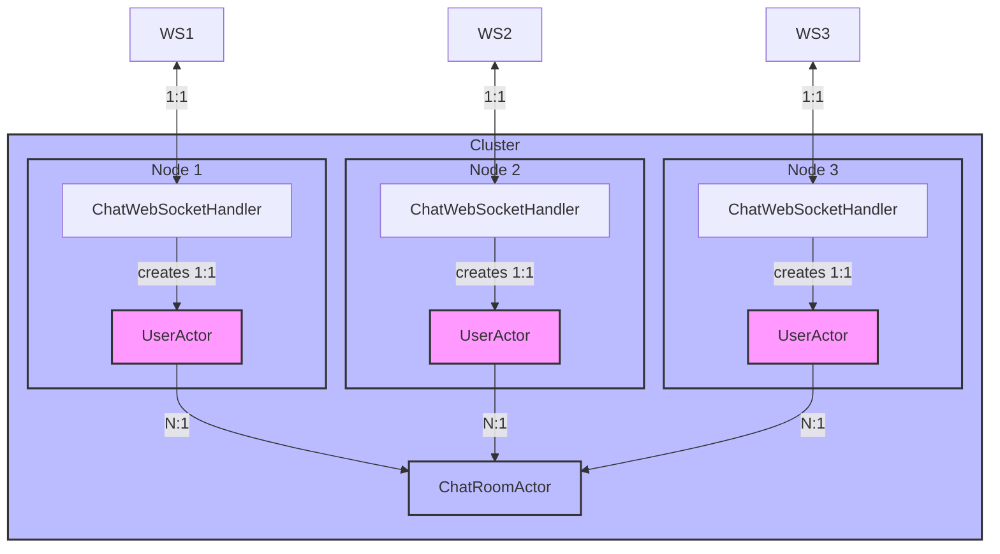

# spring-boot-chat

## Architecture



## Key Characteristics

- **WebSocket <-> UserActor**: 1:1 relationship
- **UserActor <-> ChatRoomActor**: N:1 relationship
- **UserActor**: Local actor that exists only on the node where the WebSocket connection is established
- **ChatRoomActor**: Sharded entity that lives across the cluster

## Usage

```shell
# start cluster 
$ sh cluster-start.sh 8080 2551 3

# stop cluster 
$ sh cluster-stop.sh   
```
